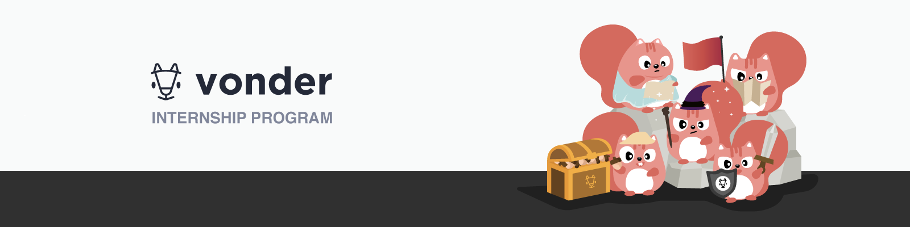

# API

### Assignment for attending internship program with Vonder
- /add_shelter post 

- /delete_shelter/:id delete

- /shelters get

- /books get

- /books/:keyword get

- /add_book post

- /delete_book delete

- /edit_book put 


```Javascript
// show all books in the list
router.get('/books',shopController.fetchAllBooks);
// show all shelter
router.get('/shelters',shopController.getAllShelter);
// add shelter
router.post('/add_shelter',shopController.AddShelter);
// add book
router.post('/add_book',shopController.AddBook);
// delete specific shelter by id
router.delete('/delete_shelter/:id',shopController.DeleteShelter);
// delete specific book by book id
router.post('/delete_book/:id',shopController.DeleteBook);
// editing specific book
router.put('/edit_book/:BookId',shopController.EditBook);
// Search by title
router.get('/findByName',shopController.SearchByTitle);
// Search by category of book
router.get('/SearchByCategory/:CategoryName',shopController.SearchByCategory);


```
##### Tools
- Nodejs
- MangoDb
- Express.js
- nodemon
- Mangoose

